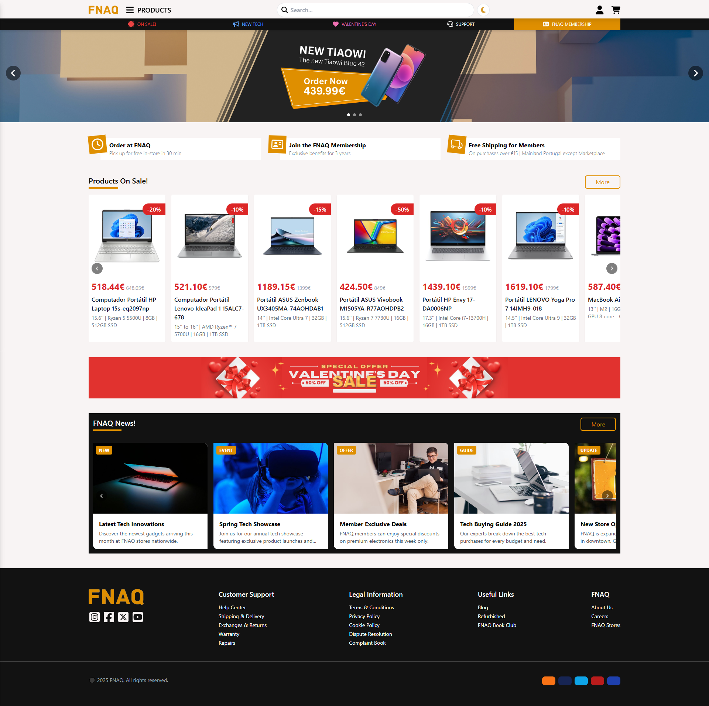

  <h1 align="center">FNAC Website Redesign</h3>

  

    The **FNAC Website Redesign** aims to completely transform and modernize the FNAC website, focusing on improving the design. 
  

  
🚧 Work in Progress

 

  
## Technologies (MERN Stack)
- `React.js`
- `React Router`
- `Context API`
- `Tailwind CSS`
- `Axios`
- `Node.js`
- `Express.js`
- `MongoDB` 

<!--
### ✨ Technologies
- `React.js` - Frontend library for building user interfaces.
- `Context API` - Lightweight state management for global state.
- `Tailwind CSS` - Utility-first CSS framework for styling.
- `React Router` - Client-side routing for React applications.
- `React Icons` - Library for using popular icons in React.
- `Axios` - HTTP client for making API requests.
- `Node.js` - JavaScript runtime for backend development.
- `Express.js` - Lightweight framework for creating API endpoints.
- `MongoDB` - NoSQL database for scalable data storage.
-->

## Features 
- **Modern UI/UX**: Built with `React` and `Tailwind CSS` to deliver a sleek, responsive, and user-friendly interface.
- **Smart Filtering**: Advanced product filtering system using `Context API` for seamless category, price range and attribute-based searches.
- **Smooth Navigation**: Intuitive routing system powered by `React Router` for a fluid browsing experience.
- **Responsive Design**: Fully optimized for all devices - desktop, tablet, and mobile views.

## 🎞️ Preview

